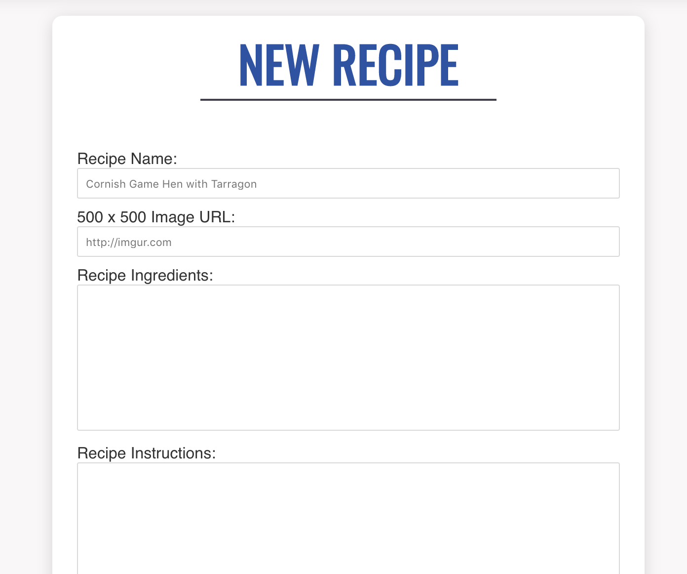
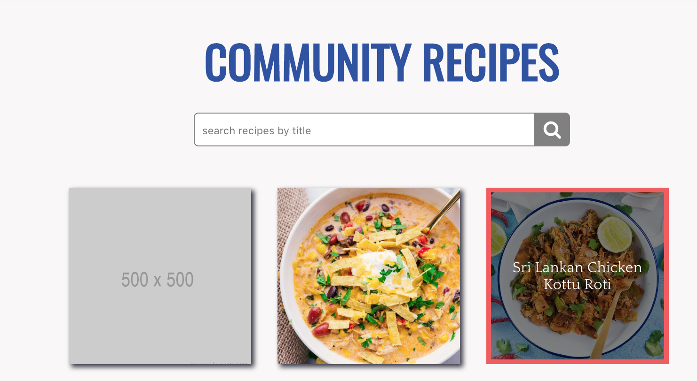

#RecipeBox

[Link to Live](https://recipe-box.victorialgodfrey.now.sh/)
[Link to API Repo](https://github.com/inertiawhoosh/my-recipe-box-api)

##Summary
RecipeBox allows users to submit recipe's to a shared Recipe Box.

Click on "New" to be brought to the submit form for new posts. 
[]

"Feed" will take you to the currently submitted recipes. 

Using "search" will allow you to search recipes by title. 
[]

Click on a recipe for additional recipe details.
[]

##In Progress
[Check out this project's Agile Board](https://trello.com/b/1X6UxStR/my-recipe-box)

##Technology Used 
React, Node.js, Express.js, PosgreSQL
