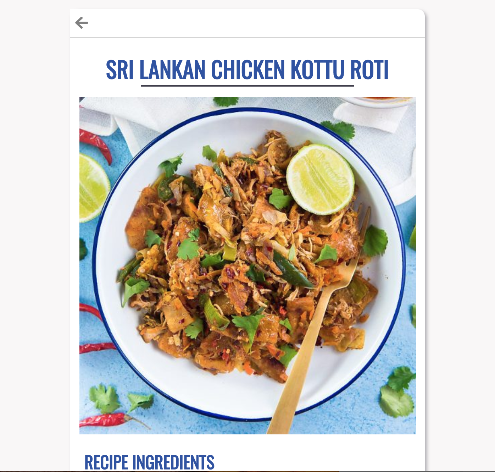

# RecipeBox

[Link to Live](https://recipe-box.victorialgodfrey.now.sh/)

[Link to API Repo](https://github.com/inertiawhoosh/my-recipe-box-api)

## Summary

RecipeBox is a full-stack React application for people who want to find their next recipe fast. Users can submit a recipe, search for a recipe by title, or view current recipes. Clicking on a recipe’s picture will bring up recipe details.

## Screenshots

Click on "New" to be brought to the submit form for new posts. 

"Feed" will take you to the currently submitted recipes. 

Using "search" will allow you to search recipes by title. 

Click on a recipe for additional recipe details.

## In Progress

[Check out this project's Agile Board](https://trello.com/b/1X6UxStR/my-recipe-box)

## Technology Used 

React, Node.js, Express.js, PosgreSQL
